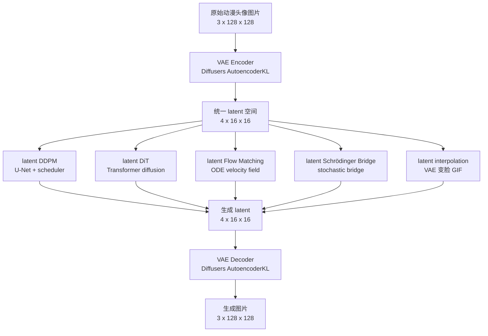

# Generative Models

本仓库的主线不是把 `VAE`、`DDPM`、`DiT`、`Flow Matching` 当成彼此割裂的方法分别实现，而是统一放在一个小型 `Stable Diffusion` 风格框架下：

```text
image -> VAE latent -> latent generator -> VAE decoder -> image
```

也就是说，本仓库里的主要生成方法默认都运行在 `VAE` 产生的 latent 空间中。差异主要在于中间的 `latent generator` 用什么方法实现。

## 核心结论

- `VAE` 负责把 `128x128` 图片压缩到 `[4, 16, 16]` latent。
- `DDPM`、`DiT`、`Flow Matching` 等方法都可以吃同一个 VAE latent。
- `Stable Diffusion` 在本仓库中表示一种工程范式：`VAE latent + 生成模型 + decoder`。
- 具体生成模型可以有不同实现：latent DDPM、latent DiT、latent Flow Matching、latent Schrödinger Bridge 等。
- 能用成熟库就用成熟库，优先 `diffusers`、`accelerate` 和 PyTorch 原生组件，不优先手写核心模型。

## 总路径图



## 理论说明

更完整的理论关系、公式和方法对比见：

```text
THEORY.md
```

## 目录定位

```text
dataset/
```

数据集说明和本地数据约定。当前默认数据目录是：

```text
dataset/raw/fullMin256
```

```text
vae/
```

统一 latent 接口。当前使用 Diffusers `AutoencoderKL`，默认权重为：

```text
stabilityai/sd-vae-ft-mse
```

核心形状：

```text
[B, 3, 128, 128] -> [B, 4, 16, 16]
```

```text
ddpm/
```

latent DDPM 路线。不是直接在像素空间扩散，而是默认在 VAE latent 空间中训练去噪模型。

```text
dit/
```

latent DiT 路线。和 DDPM 的差别主要是 backbone 从 U-Net 换成 Transformer。

```text
flow_matching/
```

latent Flow Matching 路线。目标是在同一个 VAE latent 空间中学习连续时间 ODE 速度场。

```text
vis-flow-matching/
```

独立的 MNIST Flow Matching 可视化项目。它不依赖 VAE latent，用 `28x28` MNIST 直接演示：

```text
高斯噪声 -> ODE flow -> 0..9 手写数字 GIF
```

适合用来理解 Flow Matching 的核心公式、速度场训练和采样轨迹。运行说明见：

```text
vis-flow-matching/README.md
```

```text
gan/
```

生成模型基线目录。GAN 可以作为横向对比，也可以后续尝试 latent GAN，但不是当前主线优先级。

## VAE 是统一接口

后续所有主线方法优先共享同一个 VAE latent：

```text
latent shape = [batch, 4, 16, 16]
```

这样做的原因：

- 避免每个方法各自定义输入输出，后续难以横向对比。
- 让 DDPM、DiT、Flow Matching 等方法只比较生成机制本身。
- 复用同一个 decoder，采样结果都能还原到同一图片空间。
- 更接近 Stable Diffusion 的工程结构。

## 推荐运行顺序

### 1. 准备 VAE

VAE 有两条路线，二选一。

路线 A：下载别人训练好的 VAE，然后在 DAF 上微调。

```bash
python vae/download_pretrained.py \
  --model-id stabilityai/sd-vae-ft-mse \
  --output-dir vae/pretrained/sd-vae-ft-mse
```

```bash
python vae/train_vae.py \
  --data-dir dataset/raw/fullMin256 \
  --pretrained-vae vae/pretrained/sd-vae-ft-mse \
  --output-dir vae/runs/vae_daf_finetune \
  --image-size 128 \
  --batch-size 64 \
  --epochs 50 \
  --patience 8 \
  --min-delta 1e-4 \
  --checkpoint-every-epochs 5 \
  --max-epoch-checkpoints 10
```

如果全量微调太慢，可以先用固定随机 `10%` valid 图片验证训练流程：

```bash
python vae/train_vae.py \
  --data-dir dataset/raw/fullMin256 \
  --pretrained-vae vae/pretrained/sd-vae-ft-mse \
  --output-dir vae/runs/vae_daf_finetune_10pct \
  --image-size 128 \
  --batch-size 64 \
  --epochs 50 \
  --dataset-fraction 0.1 \
  --seed 42 \
  --patience 3 \
  --min-delta 1e-4 \
  --checkpoint-every-epochs 5 \
  --max-epoch-checkpoints 10
```

路线 B：不用别人权重，从 Diffusers `AutoencoderKL` 架构随机初始化，训练自己的 VAE。

```bash
python vae/train_vae.py \
  --data-dir dataset/raw/fullMin256 \
  --init-from-scratch \
  --output-dir vae/runs/vae_daf_from_scratch \
  --image-size 128 \
  --batch-size 64 \
  --epochs 50 \
  --patience 8 \
  --min-delta 1e-4 \
  --checkpoint-every-epochs 5 \
  --max-epoch-checkpoints 10
```

路线 B 也可以先用固定随机 `10%` valid 图片验证从零训练流程：

```bash
python vae/train_vae.py \
  --data-dir dataset/raw/fullMin256 \
  --init-from-scratch \
  --output-dir vae/runs/vae_daf_from_scratch_10pct \
  --image-size 128 \
  --batch-size 64 \
  --epochs 50 \
  --dataset-fraction 0.1 \
  --seed 42 \
  --patience 3 \
  --min-delta 1e-4 \
  --checkpoint-every-epochs 5 \
  --max-epoch-checkpoints 10
```

两条路线的输出目录不同，避免互相覆盖：

```text
路线 A：vae/runs/vae_daf_finetune/best_diffusers
路线 B：vae/runs/vae_daf_from_scratch/best_diffusers
```

两条路线使用同一套数据处理和验证集逻辑：

- 先扫描 `dataset/raw/fullMin256`，过滤坏图，得到 valid 图片列表。
- 如果传 `--dataset-fraction 0.1 --seed 42`，就在 valid 图片里固定随机抽 `10%`。
- 然后再按 `--val-ratio` 划分 train / val。
- `train` 用于更新 VAE 权重，`val` 用于选择 `best_diffusers/`。
- 路线 A 和路线 B 的区别只在初始化：A 从预训练 VAE 微调，B 从随机权重开始训练。
- 全量训练命令显式使用 early stopping：`--patience 8 --min-delta 1e-4`；10% 快速验证命令显式使用 `--patience 3 --min-delta 1e-4`。

VAE 训练和 latent 缓存启动时都会扫描图片：

- 默认 `--scan-workers 8`，带 `tqdm` 进度条。
- 扫描会生成 `dataset/valid_images.txt` 和 `dataset/bad_images.txt`。
- 每次启动都会重新扫描，避免数据集变化或上次中断后沿用旧清单。
- 如果扫描结果没变化，不会重写清单文件，减少无意义 SSD 写入。
- `--dataset-fraction 0.1 --seed 42` 会在完成坏图扫描后，从 valid 图片中固定随机抽样 `10%`；默认 `1.0` 是全量训练。

默认只强制保存 `best_diffusers/`，不会无限保存 checkpoint。更细节见：

```text
vae/dataset_treatment.md
```

### 2. 缓存全量 latent

VAE best 确定后，把全量图片 encode 成单个 HDF5 文件。

路线 A：

```bash
python vae/cache_latents.py \
  --data-dir dataset/raw/fullMin256 \
  --vae-dir vae/runs/vae_daf_finetune/best_diffusers \
  --output dataset/latents/vae_daf_128_finetune.h5
```

路线 A 的 10% 快速 VAE：

```bash
python vae/cache_latents.py \
  --data-dir dataset/raw/fullMin256 \
  --vae-dir vae/runs/vae_daf_finetune_10pct/best_diffusers \
  --output dataset/latents/vae_daf_128_finetune_10pct.h5
```

路线 B：

```bash
python vae/cache_latents.py \
  --data-dir dataset/raw/fullMin256 \
  --vae-dir vae/runs/vae_daf_from_scratch/best_diffusers \
  --output dataset/latents/vae_daf_128_from_scratch.h5
```

路线 B 的 10% 快速 VAE：

```bash
python vae/cache_latents.py \
  --data-dir dataset/raw/fullMin256 \
  --vae-dir vae/runs/vae_daf_from_scratch_10pct/best_diffusers \
  --output dataset/latents/vae_daf_128_from_scratch_10pct.h5
```

输出分别是：

```text
路线 A：dataset/latents/vae_daf_128_finetune.h5
路线 A 10% 快速 VAE：dataset/latents/vae_daf_128_finetune_10pct.h5
路线 B：dataset/latents/vae_daf_128_from_scratch.h5
路线 B 10% 快速 VAE：dataset/latents/vae_daf_128_from_scratch_10pct.h5
```

HDF5 中保存的是乘过 `vae.config.scaling_factor` 的 `float16` latent，默认 gzip 压缩等级为 `1`。这里的 `10%` 指 VAE 是用 10% valid 图片训练出来的；`cache_latents.py` 默认仍会把当前数据目录的全量 valid 图片 encode 进 HDF5。

### 3. 训练不同 latent generator

选择一个或多个方法训练。具体命令见下一节“各方法训练与生成”。

不同 VAE 路线读取不同 latent 缓存：

```text
路线 A：dataset/latents/vae_daf_128_finetune.h5
路线 A 10% 快速 VAE：dataset/latents/vae_daf_128_finetune_10pct.h5
路线 B：dataset/latents/vae_daf_128_from_scratch.h5
路线 B 10% 快速 VAE：dataset/latents/vae_daf_128_from_scratch_10pct.h5
```

### 4. 采样生成图片

训练完成后，使用对应方法的 sample 命令生成图片。具体命令同样见下一节“各方法训练与生成”。

说明：

- 后续方法默认不重复读取原图，也不重复运行 VAE encoder。
- 后续方法默认读取同一个 HDF5 latent 缓存。
- 各方法的 `runs/` 输出都被 `.gitignore` 忽略。
- 训练过程会在各自 `output-dir` 下追加 `metrics.csv`，并实时覆盖保存 `metrics.jpg`，图片格式为 JPG，`dpi=200`。
- DDPM / DiT / Flow Matching 的 early stopping 按 `val_loss` 判断；GAN 按 `val_fake_score` 判断。全量路线命令使用 `--patience 8 --min-delta 1e-4`，10% 快速 VAE 路线命令使用 `--patience 3 --min-delta 1e-4`。

## 各方法训练与生成

### DDPM

路线 A：

```bash
# 训练 DDPM，读取路线 A 的 latent 缓存。
python ddpm/train.py \
  --latents-h5 dataset/latents/vae_daf_128_finetune.h5 \
  --output-dir ddpm/runs/latent_ddpm_finetune \
  --patience 8 \
  --min-delta 1e-4

# 生成 128 张 jpg 图片，使用路线 A 的 VAE decoder。
python ddpm/sample.py \
  --model-dir ddpm/runs/latent_ddpm_finetune/best_model \
  --vae-dir vae/runs/vae_daf_finetune/best_diffusers \
  --num-images 128 \
  --output-dir ddpm/runs/latent_ddpm_finetune/samples_jpg \
  --image-format jpg
```

路线 A 10% 快速 VAE：

```bash
# 训练 DDPM，读取 10% 快速 VAE 生成的 latent 缓存。
python ddpm/train.py \
  --latents-h5 dataset/latents/vae_daf_128_finetune_10pct.h5 \
  --output-dir ddpm/runs/latent_ddpm_finetune_10pct \
  --patience 3 \
  --min-delta 1e-4

# 生成 128 张 jpg 图片，使用 10% 快速 VAE 的 decoder。
python ddpm/sample.py \
  --model-dir ddpm/runs/latent_ddpm_finetune_10pct/best_model \
  --vae-dir vae/runs/vae_daf_finetune_10pct/best_diffusers \
  --num-images 128 \
  --output-dir ddpm/runs/latent_ddpm_finetune_10pct/samples_jpg \
  --image-format jpg
```

路线 B：

```bash
# 训练 DDPM，读取路线 B 的 latent 缓存。
python ddpm/train.py \
  --latents-h5 dataset/latents/vae_daf_128_from_scratch.h5 \
  --output-dir ddpm/runs/latent_ddpm_from_scratch \
  --patience 8 \
  --min-delta 1e-4

# 生成 128 张 jpg 图片，使用路线 B 的 VAE decoder。
python ddpm/sample.py \
  --model-dir ddpm/runs/latent_ddpm_from_scratch/best_model \
  --vae-dir vae/runs/vae_daf_from_scratch/best_diffusers \
  --num-images 128 \
  --output-dir ddpm/runs/latent_ddpm_from_scratch/samples_jpg \
  --image-format jpg
```

路线 B 10% 快速 VAE：

```bash
# 训练 DDPM，读取路线 B 10% 快速 VAE 生成的 latent 缓存。
python ddpm/train.py \
  --latents-h5 dataset/latents/vae_daf_128_from_scratch_10pct.h5 \
  --output-dir ddpm/runs/latent_ddpm_from_scratch_10pct \
  --patience 3 \
  --min-delta 1e-4

# 生成 128 张 jpg 图片，使用路线 B 10% 快速 VAE 的 decoder。
python ddpm/sample.py \
  --model-dir ddpm/runs/latent_ddpm_from_scratch_10pct/best_model \
  --vae-dir vae/runs/vae_daf_from_scratch_10pct/best_diffusers \
  --num-images 128 \
  --output-dir ddpm/runs/latent_ddpm_from_scratch_10pct/samples_jpg \
  --image-format jpg
```

### DiT

路线 A：

```bash
# 训练 DiT，读取路线 A 的 latent 缓存。
python dit/train.py \
  --latents-h5 dataset/latents/vae_daf_128_finetune.h5 \
  --output-dir dit/runs/latent_dit_finetune \
  --patience 8 \
  --min-delta 1e-4

# 生成 128 张 jpg 图片，使用路线 A 的 VAE decoder。
python dit/sample.py \
  --model-dir dit/runs/latent_dit_finetune/best_model \
  --vae-dir vae/runs/vae_daf_finetune/best_diffusers \
  --num-images 128 \
  --output-dir dit/runs/latent_dit_finetune/samples_jpg \
  --image-format jpg
```

路线 A 10% 快速 VAE：

```bash
# 训练 DiT，读取 10% 快速 VAE 生成的 latent 缓存。
python dit/train.py \
  --latents-h5 dataset/latents/vae_daf_128_finetune_10pct.h5 \
  --output-dir dit/runs/latent_dit_finetune_10pct \
  --patience 3 \
  --min-delta 1e-4

# 生成 128 张 jpg 图片，使用 10% 快速 VAE 的 decoder。
python dit/sample.py \
  --model-dir dit/runs/latent_dit_finetune_10pct/best_model \
  --vae-dir vae/runs/vae_daf_finetune_10pct/best_diffusers \
  --num-images 128 \
  --output-dir dit/runs/latent_dit_finetune_10pct/samples_jpg \
  --image-format jpg
```

路线 B：

```bash
# 训练 DiT，读取路线 B 的 latent 缓存。
python dit/train.py \
  --latents-h5 dataset/latents/vae_daf_128_from_scratch.h5 \
  --output-dir dit/runs/latent_dit_from_scratch \
  --patience 8 \
  --min-delta 1e-4

# 生成 128 张 jpg 图片，使用路线 B 的 VAE decoder。
python dit/sample.py \
  --model-dir dit/runs/latent_dit_from_scratch/best_model \
  --vae-dir vae/runs/vae_daf_from_scratch/best_diffusers \
  --num-images 128 \
  --output-dir dit/runs/latent_dit_from_scratch/samples_jpg \
  --image-format jpg
```

路线 B 10% 快速 VAE：

```bash
# 训练 DiT，读取路线 B 10% 快速 VAE 生成的 latent 缓存。
python dit/train.py \
  --latents-h5 dataset/latents/vae_daf_128_from_scratch_10pct.h5 \
  --output-dir dit/runs/latent_dit_from_scratch_10pct \
  --patience 3 \
  --min-delta 1e-4

# 生成 128 张 jpg 图片，使用路线 B 10% 快速 VAE 的 decoder。
python dit/sample.py \
  --model-dir dit/runs/latent_dit_from_scratch_10pct/best_model \
  --vae-dir vae/runs/vae_daf_from_scratch_10pct/best_diffusers \
  --num-images 128 \
  --output-dir dit/runs/latent_dit_from_scratch_10pct/samples_jpg \
  --image-format jpg
```

### Flow Matching

路线 A：

```bash
# 训练 Flow Matching，读取路线 A 的 latent 缓存。
python flow_matching/train.py \
  --latents-h5 dataset/latents/vae_daf_128_finetune.h5 \
  --output-dir flow_matching/runs/latent_fm_finetune \
  --patience 8 \
  --min-delta 1e-4

# 生成 128 张 jpg 图片，使用路线 A 的 VAE decoder。
python flow_matching/sample.py \
  --model-dir flow_matching/runs/latent_fm_finetune/best_model \
  --vae-dir vae/runs/vae_daf_finetune/best_diffusers \
  --num-images 128 \
  --output-dir flow_matching/runs/latent_fm_finetune/samples_jpg \
  --image-format jpg
```

路线 A 10% 快速 VAE：

```bash
# 训练 Flow Matching，读取 10% 快速 VAE 生成的 latent 缓存。
python flow_matching/train.py \
  --latents-h5 dataset/latents/vae_daf_128_finetune_10pct.h5 \
  --output-dir flow_matching/runs/latent_fm_finetune_10pct \
  --patience 3 \
  --min-delta 1e-4

# 生成 128 张 jpg 图片，使用 10% 快速 VAE 的 decoder。
python flow_matching/sample.py \
  --model-dir flow_matching/runs/latent_fm_finetune_10pct/best_model \
  --vae-dir vae/runs/vae_daf_finetune_10pct/best_diffusers \
  --num-images 128 \
  --output-dir flow_matching/runs/latent_fm_finetune_10pct/samples_jpg \
  --image-format jpg
```

路线 B：

```bash
# 训练 Flow Matching，读取路线 B 的 latent 缓存。
python flow_matching/train.py \
  --latents-h5 dataset/latents/vae_daf_128_from_scratch.h5 \
  --output-dir flow_matching/runs/latent_fm_from_scratch \
  --patience 8 \
  --min-delta 1e-4

# 生成 128 张 jpg 图片，使用路线 B 的 VAE decoder。
python flow_matching/sample.py \
  --model-dir flow_matching/runs/latent_fm_from_scratch/best_model \
  --vae-dir vae/runs/vae_daf_from_scratch/best_diffusers \
  --num-images 128 \
  --output-dir flow_matching/runs/latent_fm_from_scratch/samples_jpg \
  --image-format jpg
```

路线 B 10% 快速 VAE：

```bash
# 训练 Flow Matching，读取路线 B 10% 快速 VAE 生成的 latent 缓存。
python flow_matching/train.py \
  --latents-h5 dataset/latents/vae_daf_128_from_scratch_10pct.h5 \
  --output-dir flow_matching/runs/latent_fm_from_scratch_10pct \
  --patience 3 \
  --min-delta 1e-4

# 生成 128 张 jpg 图片，使用路线 B 10% 快速 VAE 的 decoder。
python flow_matching/sample.py \
  --model-dir flow_matching/runs/latent_fm_from_scratch_10pct/best_model \
  --vae-dir vae/runs/vae_daf_from_scratch_10pct/best_diffusers \
  --num-images 128 \
  --output-dir flow_matching/runs/latent_fm_from_scratch_10pct/samples_jpg \
  --image-format jpg
```

### GAN

路线 A：

```bash
# 训练 latent GAN，读取路线 A 的 latent 缓存。
python gan/train.py \
  --latents-h5 dataset/latents/vae_daf_128_finetune.h5 \
  --output-dir gan/runs/latent_gan_finetune \
  --patience 8 \
  --min-delta 1e-4

# 生成 128 张 jpg 图片，使用路线 A 的 VAE decoder。
python gan/sample.py \
  --checkpoint gan/runs/latent_gan_finetune/best.pt \
  --vae-dir vae/runs/vae_daf_finetune/best_diffusers \
  --num-images 128 \
  --output-dir gan/runs/latent_gan_finetune/samples_jpg \
  --image-format jpg
```

路线 A 10% 快速 VAE：

```bash
# 训练 latent GAN，读取 10% 快速 VAE 生成的 latent 缓存。
python gan/train.py \
  --latents-h5 dataset/latents/vae_daf_128_finetune_10pct.h5 \
  --output-dir gan/runs/latent_gan_finetune_10pct \
  --patience 3 \
  --min-delta 1e-4

# 生成 128 张 jpg 图片，使用 10% 快速 VAE 的 decoder。
python gan/sample.py \
  --checkpoint gan/runs/latent_gan_finetune_10pct/best.pt \
  --vae-dir vae/runs/vae_daf_finetune_10pct/best_diffusers \
  --num-images 128 \
  --output-dir gan/runs/latent_gan_finetune_10pct/samples_jpg \
  --image-format jpg
```

路线 B：

```bash
# 训练 latent GAN，读取路线 B 的 latent 缓存。
python gan/train.py \
  --latents-h5 dataset/latents/vae_daf_128_from_scratch.h5 \
  --output-dir gan/runs/latent_gan_from_scratch \
  --patience 8 \
  --min-delta 1e-4

# 生成 128 张 jpg 图片，使用路线 B 的 VAE decoder。
python gan/sample.py \
  --checkpoint gan/runs/latent_gan_from_scratch/best.pt \
  --vae-dir vae/runs/vae_daf_from_scratch/best_diffusers \
  --num-images 128 \
  --output-dir gan/runs/latent_gan_from_scratch/samples_jpg \
  --image-format jpg
```

路线 B 10% 快速 VAE：

```bash
# 训练 latent GAN，读取路线 B 10% 快速 VAE 生成的 latent 缓存。
python gan/train.py \
  --latents-h5 dataset/latents/vae_daf_128_from_scratch_10pct.h5 \
  --output-dir gan/runs/latent_gan_from_scratch_10pct \
  --patience 3 \
  --min-delta 1e-4

# 生成 128 张 jpg 图片，使用路线 B 10% 快速 VAE 的 decoder。
python gan/sample.py \
  --checkpoint gan/runs/latent_gan_from_scratch_10pct/best.pt \
  --vae-dir vae/runs/vae_daf_from_scratch_10pct/best_diffusers \
  --num-images 128 \
  --output-dir gan/runs/latent_gan_from_scratch_10pct/samples_jpg \
  --image-format jpg
```

## 测试

测试脚本放在：

```text
test/
```

运行：

```bash
python -m unittest discover -s test -p "test_*.py"
```

或者：

```bash
bash test/run_dry_tests.sh
```

这些测试只做语法、模型前向、HDF5 小样本读写和 dry-run 级验证，不运行真实训练，不写大 checkpoint。

## VAE 插值

VAE 本身也可以做两张图之间的平滑过渡，不需要 DDPM 或 diffusion：

```text
image A -> encoder -> latent A
image B -> encoder -> latent B
latent A/B 插值
插值 latent -> decoder -> GIF
```

对应脚本：

```bash
python vae/interpolate_gif.py \
  --image-a path/to/a.jpg \
  --image-b path/to/b.jpg \
  --output vae/runs/interpolation.gif
```

## 当前实现原则

- 不优先手写 VAE、U-Net、scheduler 等核心组件。
- 优先复用 `diffusers.AutoencoderKL` 等成熟库实现。
- 默认考虑 Apple Silicon `MPS`。
- 自己写的代码主要做路径、数据、训练入口、日志、checkpoint 和各方法自己的采样生成脚本。
- 如果某个模块必须自定义实现，需要先说明原因和风险。
