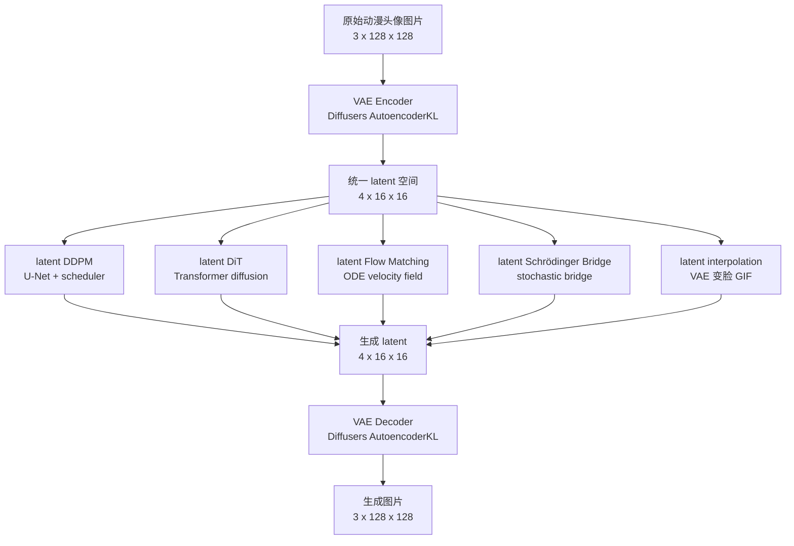

# Generative Models

本仓库的主线不是把 `VAE`、`DDPM`、`DiT`、`Flow Matching` 当成彼此割裂的方法分别实现，而是统一放在一个小型 `Stable Diffusion` 风格框架下：

```text
image -> VAE latent -> latent generator -> VAE decoder -> image
```

也就是说，本仓库里的主要生成方法默认都运行在 `VAE` 产生的 latent 空间中。差异主要在于中间的 `latent generator` 用什么方法实现。

## 核心结论

- `VAE` 负责把 `128x128` 图片压缩到 `[4, 16, 16]` latent。
- `DDPM`、`DiT`、`Flow Matching` 等方法都可以吃同一个 VAE latent。
- `Stable Diffusion` 在本仓库中表示一种工程范式：`VAE latent + 生成模型 + decoder`。
- 具体生成模型可以有不同实现：latent DDPM、latent DiT、latent Flow Matching、latent Schrödinger Bridge 等。
- 能用成熟库就用成熟库，优先 `diffusers`、`accelerate` 和 PyTorch 原生组件，不优先手写核心模型。

## 总路径图



## 理论说明

更完整的理论关系、公式和方法对比见：

```text
THEORY.md
```

## 目录定位

```text
dataset/
```

数据集说明和本地数据约定。当前默认数据目录是：

```text
dataset/raw/fullMin256
```

```text
vae/
```

统一 latent 接口。当前使用 Diffusers `AutoencoderKL`，默认权重为：

```text
stabilityai/sd-vae-ft-mse
```

核心形状：

```text
[B, 3, 128, 128] -> [B, 4, 16, 16]
```

```text
ddpm/
```

latent DDPM 路线。不是直接在像素空间扩散，而是默认在 VAE latent 空间中训练去噪模型。

```text
dit/
```

latent DiT 路线。和 DDPM 的差别主要是 backbone 从 U-Net 换成 Transformer。

```text
flow_matching/
```

latent Flow Matching 路线。目标是在同一个 VAE latent 空间中学习连续时间 ODE 速度场。

```text
gan/
```

生成模型基线目录。GAN 可以作为横向对比，也可以后续尝试 latent GAN，但不是当前主线优先级。

## VAE 是统一接口

后续所有主线方法优先共享同一个 VAE latent：

```text
latent shape = [batch, 4, 16, 16]
```

这样做的原因：

- 避免每个方法各自定义输入输出，后续难以横向对比。
- 让 DDPM、DiT、Flow Matching 等方法只比较生成机制本身。
- 复用同一个 decoder，采样结果都能还原到同一图片空间。
- 更接近 Stable Diffusion 的工程结构。

## VAE 插值

VAE 本身也可以做两张图之间的平滑过渡，不需要 DDPM 或 diffusion：

```text
image A -> encoder -> latent A
image B -> encoder -> latent B
latent A/B 插值
插值 latent -> decoder -> GIF
```

对应脚本：

```bash
python vae/interpolate_gif.py \
  --image-a path/to/a.jpg \
  --image-b path/to/b.jpg \
  --output vae/runs/interpolation.gif
```

## 当前实现原则

- 不优先手写 VAE、U-Net、scheduler 等核心组件。
- 优先复用 `diffusers.AutoencoderKL` 等成熟库实现。
- 默认考虑 Apple Silicon `MPS`。
- 自己写的代码主要做路径、数据、训练入口、日志、checkpoint 和各方法自己的采样生成脚本。
- 如果某个模块必须自定义实现，需要先说明原因和风险。
