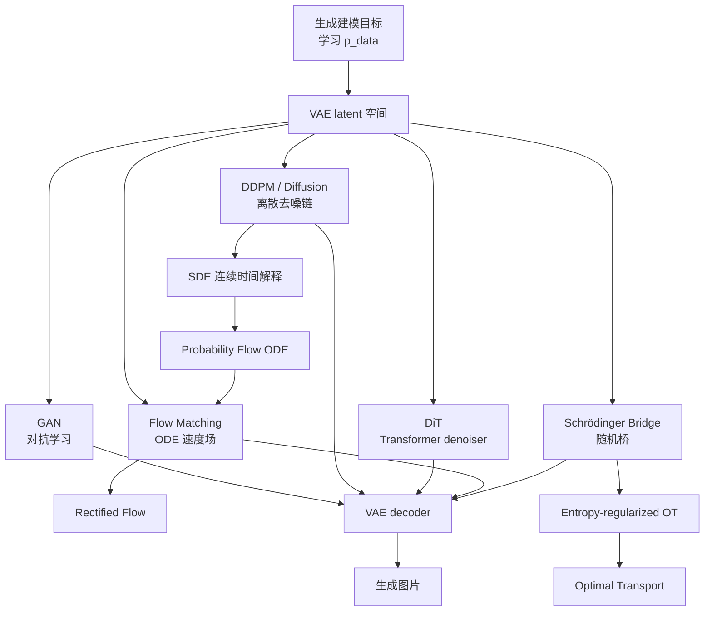

# 图像生成模型理论说明

## 摘要

本仓库关注的不是彼此孤立的生成模型实现，而是围绕同一个 `Stable Diffusion` 风格范式组织不同生成方法：

```text
image -> VAE encoder -> latent -> generator -> latent -> VAE decoder -> image
```

其中 `VAE` 提供统一的低维连续 latent 空间，`GAN`、`DDPM`、`DiT`、`Flow Matching`、`Schrödinger Bridge` 等方法可以被理解为不同的 latent 生成机制或对照基线。本文档从理论角度说明这些方法的目标函数、采样过程和相互关系。

当前仓库固定的 latent 接口为：

```text
x in R^{3 x 128 x 128}
z in R^{4 x 16 x 16}
```

这意味着后续主线方法默认不直接在像素空间建模，而是在 VAE latent 空间中建模。

## 统一问题定义

生成建模的目标是学习真实数据分布 `p_data(x)`，并构造一个可采样模型 `p_theta(x)`，使得：

```text
p_theta(x) ≈ p_data(x)
```

在 latent 生成框架下，先使用 encoder 把图片映射到 latent：

```text
z = E(x)
```

再在 latent 空间中学习分布：

```text
p_theta(z) ≈ p_data(z)
```

最后通过 decoder 还原图片：

```text
x_hat = D(z)
```

因此本仓库后续多数方法的核心问题不是“直接生成图片”，而是：

```text
如何生成高质量 latent z？
```

## VAE

### 基本思想

`VAE`，即 Variational Autoencoder，把图像 `x` 编码成一个概率分布，而不是一个固定向量。典型形式为：

```text
q_phi(z | x) = N(mu_phi(x), sigma_phi(x)^2 I)
```

然后从该分布采样 latent：

```text
z = mu + sigma * epsilon,   epsilon ~ N(0, I)
```

decoder 根据 latent 重建图像：

```text
p_theta(x | z)
```

### 目标函数

VAE 最大化证据下界，即 ELBO：

```text
log p_theta(x) >= E_{q_phi(z|x)}[log p_theta(x|z)] - KL(q_phi(z|x) || p(z))
```

训练时通常最小化：

```text
L_VAE = L_recon + beta * L_KL
```

其中：

```text
L_recon = ||x - x_hat||^2
```

```text
L_KL = KL(q_phi(z|x) || N(0, I))
```

如果 `q_phi(z|x) = N(mu, sigma^2 I)`，KL 项可以写成：

```text
L_KL = -1/2 * sum(1 + log(sigma^2) - mu^2 - sigma^2)
```

### 在 Stable Diffusion 中的作用

Stable Diffusion 不直接在像素空间做扩散，而是在 VAE latent 空间做扩散。VAE 的作用是：

```text
image -> latent
latent -> image
```

本仓库使用 Diffusers `AutoencoderKL`，默认接口为：

```text
[B, 3, 128, 128] -> [B, 4, 16, 16]
```

Diffusers 还使用 scaling factor：

```text
z_scaled = z * vae.config.scaling_factor
```

解码时需要除回去：

```text
x_hat = decoder(z_scaled / scaling_factor)
```

## GAN

### 基本思想

`GAN`，即 Generative Adversarial Network，由生成器 `G` 和判别器 `D` 组成。

生成器把随机噪声变成样本：

```text
x_fake = G(epsilon),   epsilon ~ N(0, I)
```

判别器判断输入是真实图片还是生成图片：

```text
D(x) -> [0, 1]
```

### 原始目标函数

经典 GAN 的 minimax 目标是：

```text
min_G max_D E_{x~p_data}[log D(x)] + E_{epsilon~p(epsilon)}[log(1 - D(G(epsilon)))]
```

判别器希望把真实图判为真，把生成图判为假；生成器希望骗过判别器。

### 与 latent 路线的关系

GAN 可以有两种放法：

```text
noise -> GAN -> image
```

或者：

```text
noise -> GAN -> latent -> VAE decoder -> image
```

第二种是 latent GAN。它和本仓库的 VAE latent 统一框架更一致，但 GAN 训练稳定性通常弱于 diffusion / flow 路线，因此当前只作为基线方向。

## DDPM

### 基本思想

`DDPM`，即 Denoising Diffusion Probabilistic Model，把生成过程拆成两部分：

1. 正向过程：逐步给数据加噪声。
2. 反向过程：学习逐步去噪。

正向过程从真实样本 `x_0` 开始：

```text
q(x_t | x_{t-1}) = N(sqrt(1 - beta_t) x_{t-1}, beta_t I)
```

其中 `beta_t` 是噪声调度。

定义：

```text
alpha_t = 1 - beta_t
```

```text
alpha_bar_t = product_{s=1}^{t} alpha_s
```

则可以直接从 `x_0` 采样任意时间步的噪声样本：

```text
x_t = sqrt(alpha_bar_t) x_0 + sqrt(1 - alpha_bar_t) epsilon
```

其中：

```text
epsilon ~ N(0, I)
```

### 训练目标

DDPM 常训练网络预测噪声：

```text
epsilon_theta(x_t, t) ≈ epsilon
```

损失为：

```text
L_DDPM = E_{x_0, epsilon, t}[||epsilon - epsilon_theta(x_t, t)||^2]
```

也可以训练网络预测 `x_0` 或 velocity `v`，但预测噪声是最常见入门形式。

### 采样过程

采样从高斯噪声开始：

```text
x_T ~ N(0, I)
```

然后从 `T` 到 `0` 逐步去噪：

```text
x_T -> x_{T-1} -> ... -> x_0
```

### latent DDPM

如果直接在图片空间做 DDPM，变量是：

```text
x_t in R^{3 x 128 x 128}
```

在 Stable Diffusion 风格路线中，DDPM 运行在 latent 空间：

```text
z_t in R^{4 x 16 x 16}
```

训练目标变成：

```text
epsilon_theta(z_t, t) ≈ epsilon
```

采样得到 latent 后，再用 VAE decoder 还原图片：

```text
z_0 -> VAE decoder -> x
```

这就是本仓库 `ddpm/` 的合理定位：不是像素 DDPM，而是 latent DDPM。

## Stable Diffusion

### 工程定义

在本仓库中，`Stable Diffusion` 不是单指某个官方模型，而是指一种工程结构：

```text
VAE latent + latent generator + VAE decoder
```

最典型的 Stable Diffusion 使用：

```text
AutoencoderKL + U-Net denoiser + diffusion scheduler
```

如果把 U-Net 换成 DiT，则得到 latent DiT；如果把 DDPM 去噪过程换成 ODE 速度场，则得到 latent Flow Matching。

本仓库不再保留单独的 `stable_diffusion/` 目录。原因是这里的 Stable Diffusion 表示整体范式，而不是一个独立于 `ddpm/`、`dit/`、`flow_matching/` 的方法目录。实际执行顺序是先运行 `vae/` 固定 latent 接口，再运行具体生成方法目录，最后由各方法自己的采样脚本调用 VAE decoder 生成图片。

### 为什么使用 latent 空间

像素空间维度较高：

```text
3 x 128 x 128 = 49152
```

当前 latent 空间维度为：

```text
4 x 16 x 16 = 1024
```

压缩比例约为：

```text
49152 / 1024 = 48
```

在 latent 空间训练生成模型有几个好处：

- 计算量更低。
- 建模目标更接近语义和结构信息。
- 可以复用成熟 VAE decoder。
- 不同生成方法可以在同一 latent 接口下横向比较。

## DiT

### 基本思想

`DiT`，即 Diffusion Transformer，把 diffusion 模型中的 denoiser backbone 从 U-Net 换成 Transformer。

传统 latent diffusion 常用：

```text
epsilon_theta(z_t, t) = U-Net(z_t, t)
```

DiT 使用：

```text
epsilon_theta(z_t, t) = Transformer(patchify(z_t), t)
```

### patch 表示

latent 通常是二维 feature map：

```text
z_t in R^{C x H x W}
```

DiT 会把它切成 patch tokens：

```text
z_t -> tokens
```

然后通过 Transformer 处理 token 序列。

### 与 DDPM 的关系

DiT 通常仍然可以使用 DDPM / diffusion 的训练目标：

```text
L = ||epsilon - epsilon_theta(z_t, t)||^2
```

所以 DiT 不是一定替代 DDPM 的数学框架，而是常常替代 U-Net 的网络结构。

在本仓库中：

```text
ddpm/ = latent diffusion + U-Net 类 denoiser
dit/ = latent diffusion + Transformer denoiser
```

## ODE

### 基本形式

ODE 描述确定性连续动力系统：

```text
dx / dt = v_theta(x, t)
```

给定初始点 `x(0)`，轨迹由速度场 `v_theta` 唯一决定。

在生成建模中，可以从简单分布出发：

```text
x(0) ~ p_0
```

通过 ODE 积分得到数据分布：

```text
x(1) ~ p_data
```

### probability flow ODE

很多 diffusion / SDE 模型都有一个对应的 deterministic ODE，称为 probability flow ODE。它能在边缘分布上和原 SDE 保持一致，但采样路径没有随机噪声。

这说明 diffusion、SDE 和 ODE 不是完全割裂的路线。

## SDE

### 基本形式

SDE 在 ODE 的基础上加入随机噪声：

```text
dx = f(x, t) dt + g(t) dW
```

其中：

```text
dW = Brownian motion increment
```

`f(x,t)` 是 drift，`g(t)` 是 diffusion coefficient。

### diffusion 模型中的 SDE

连续时间 diffusion 可以写成正向 SDE：

```text
dx = f(x, t) dt + g(t) dW
```

反向生成过程也是一个 SDE：

```text
dx = [f(x,t) - g(t)^2 score(x,t)] dt + g(t) dW_bar
```

其中 score 是：

```text
score(x,t) = grad_x log p_t(x)
```

DDPM 可以理解为这类连续时间 SDE 的一种离散化版本。

## Flow Matching

### 基本思想

`Flow Matching` 直接学习 ODE 的速度场，而不是显式模拟 DDPM 的逐步加噪和去噪。

目标是学习：

```text
dx / dt = v_theta(x, t)
```

使得从简单分布 `p_0` 出发，沿 ODE 流动到数据分布 `p_1`。

### 条件路径

常见做法是在噪声样本 `x_0` 和数据样本 `x_1` 之间定义一条路径：

```text
x_t = (1 - t) x_0 + t x_1
```

对应速度为：

```text
u_t = x_1 - x_0
```

训练目标：

```text
L_FM = E[||v_theta(x_t, t) - u_t||^2]
```

这是一种最简单的线性路径形式。实际 Flow Matching 可以使用更复杂的条件概率路径。

### latent Flow Matching

在本仓库中，Flow Matching 默认运行在 latent 空间：

```text
z_t = (1 - t) z_0 + t z_1
```

其中：

```text
z_0 ~ N(0, I)
z_1 = VAE encoder(image)
```

训练模型：

```text
v_theta(z_t, t) ≈ z_1 - z_0
```

采样时从噪声 latent 出发，使用 ODE solver 积分到数据 latent：

```text
z_0 -> z_1
```

然后：

```text
z_1 -> VAE decoder -> image
```

## Rectified Flow

`Rectified Flow` 可以看作 Flow Matching 的一种重要相关路线。它强调学习尽可能直的传输路径，使采样可以用更少的 ODE 步数完成。

典型训练形式也接近：

```text
z_t = (1 - t) z_0 + t z_1
```

```text
v_theta(z_t, t) ≈ z_1 - z_0
```

和 DDPM 相比，它更偏向连续 ODE 速度场建模，而不是离散去噪链。

## Schrödinger Bridge

### 基本思想

`Schrödinger Bridge` 研究的是：在两个分布之间寻找一个随机过程，使它既能连接起点分布和终点分布，又尽量接近某个参考随机过程。

可以写成：

```text
min_P KL(P || R)
```

约束为：

```text
P_0 = p_0
P_1 = p_1
```

其中：

- `P` 是要学习的路径分布。
- `R` 是参考随机过程，常见是 Brownian motion 或 diffusion process。
- `p_0` 是起点分布。
- `p_1` 是终点分布。

### 与最优传输的关系

最优传输寻找从 `p_0` 到 `p_1` 的低成本确定性或耦合传输。

Schrödinger Bridge 可以理解为带熵正则的最优传输：

```text
Optimal Transport + entropy regularization
```

它比普通 ODE flow 更随机，也和 SDE / diffusion 有密切关系。

### 在生成模型中的意义

如果设：

```text
p_0 = noise distribution
p_1 = data distribution
```

Schrödinger Bridge 就是在学习一个随机过程，把噪声分布桥接到数据分布。

在本仓库中，它可以作为后续高级 latent 生成路线：

```text
noise latent -> stochastic bridge -> data latent -> VAE decoder -> image
```

但它理论和工程复杂度都高于 DDPM 和 Flow Matching，因此不作为第一优先级。

## 方法关系总图



## 方法对比

| 方法 | 建模空间 | 核心对象 | 采样方式 | 优点 | 主要风险 |
| --- | --- | --- | --- | --- | --- |
| VAE | image <-> latent | encoder / decoder | 一次 encode/decode | 提供统一 latent，推理快 | 重建可能偏糊 |
| GAN | image 或 latent | generator / discriminator | 一次前向 | 采样快 | 训练不稳定，mode collapse |
| DDPM | pixel 或 latent | denoiser / scheduler | 多步去噪 | 稳定，生态成熟 | 采样慢 |
| DiT | latent | Transformer denoiser | 多步去噪 | 扩展性强 | 数据和算力需求更高 |
| Flow Matching | latent | ODE velocity field | ODE 积分 | 连续时间，采样步数可少 | 工程生态弱于 DDPM |
| Schrödinger Bridge | latent | stochastic bridge | SDE / iterative bridge | 理论统一，连接 OT 和 diffusion | 理论和实现复杂 |

## 本仓库实现优先级

当前推荐顺序：

1. 固定 VAE latent 接口。
2. 基于 Diffusers `AutoencoderKL` 做 latent 编码和解码。
3. 实现 latent DDPM，优先复用 Diffusers scheduler 和 U-Net 组件。
4. 实现 latent Flow Matching，用同一 latent 数据做对照。
5. 实现 latent DiT，验证 Transformer backbone。
6. 视情况再考虑 Schrödinger Bridge。
7. GAN 作为横向生成基线，不作为 Stable Diffusion 主线优先项。

## 结论

本仓库可以理解为一个统一的 latent generation 实验框架：

```text
VAE 提供空间
DDPM / DiT / Flow Matching / Schrödinger Bridge 提供生成动力学
VAE decoder 负责回到图片空间
```

因此各目录不是互相割裂的模型集合，而是同一个 `Stable Diffusion` 风格系统中的不同生成器实现。
