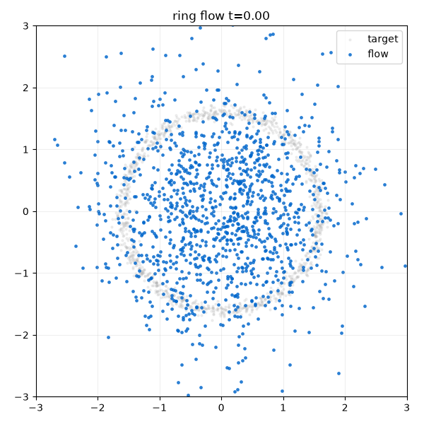
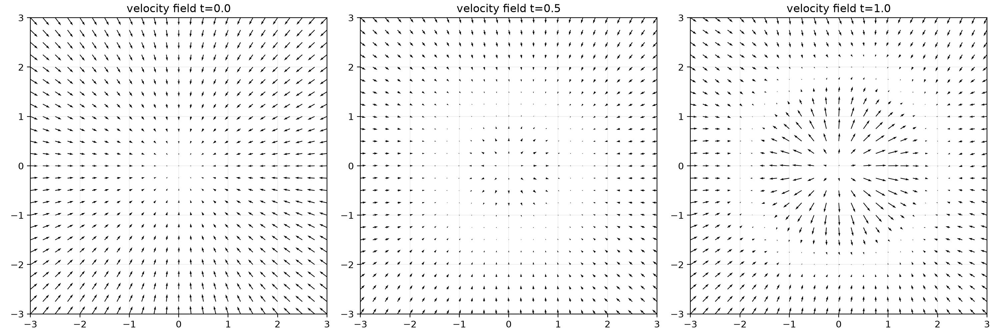
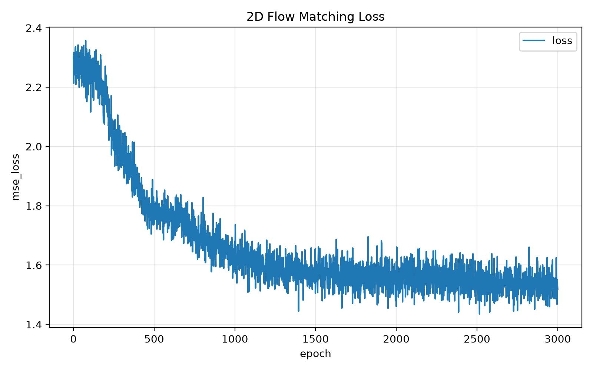
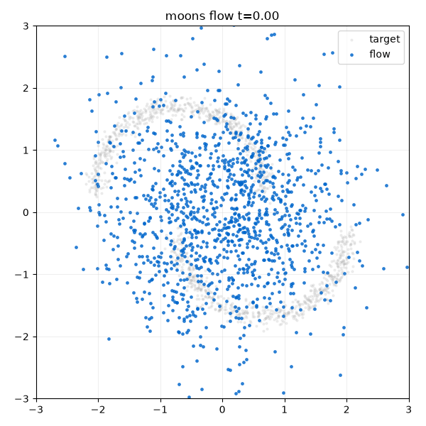
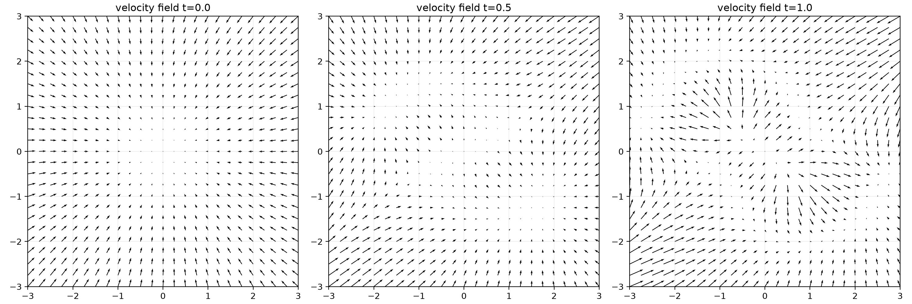
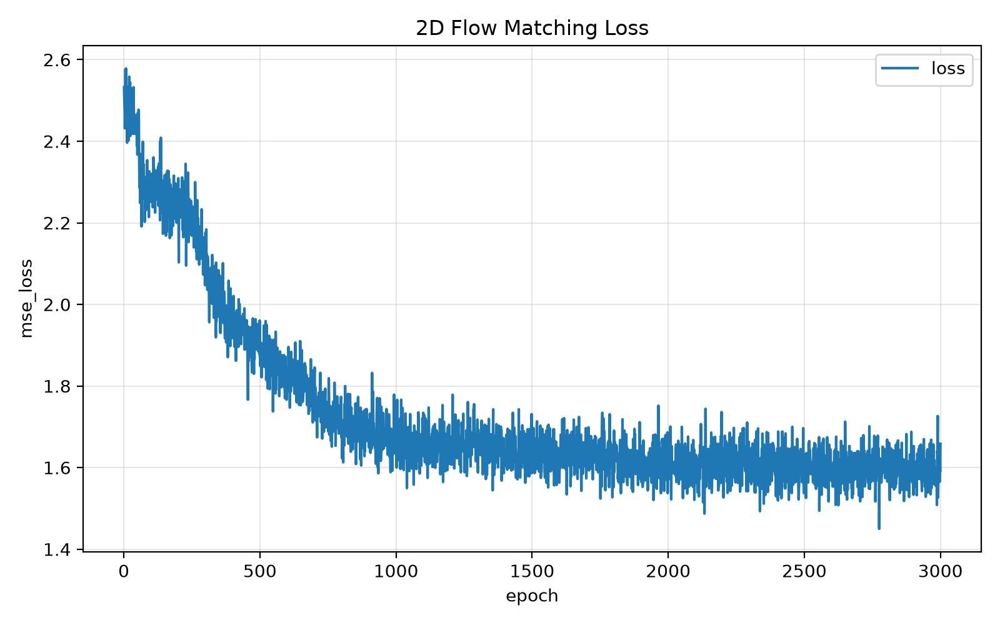

# vis-2d-flowmatching

本目录是二维 Flow Matching 可视化项目，用来看到“点沿着速度场移动到目标分布”的过程。

包含两个经典分布：

- `ring`：圆环。
- `moons`：两个半圆。

两个入口共用同一套 Flow Matching 系统：

- `distributions.py`：二维目标分布采样。
- `model.py`：共享的 MLP velocity field。
- `system.py`：训练、Euler ODE 采样、GIF、风向图保存。
- `run_ring.py`：圆环入口。
- `run_moons.py`：双半圆入口。

## 公式

训练目标：

```text
x0 ~ N(0, I)
x1 ~ target distribution
t ~ Uniform(0, 1)
xt = (1 - t) * x0 + t * x1
v_target = x1 - x0
loss = MSE(v_theta(xt, t), v_target)
```

采样：

```text
dx / dt = v_theta(x, t)
```

## 圆环

```bash
python vis-2d-flowmatching/run_ring.py \
  --output-dir vis-2d-flowmatching/runs/ring \
  --epochs 3000 \
  --batch-size 2048 \
  --lr 2e-4 \
  --gif-steps 160 \
  --fps 10 \
  --hold-final-frames 30 \
  --seed 42
```

输出：

```text
vis-2d-flowmatching/runs/ring/ring_flow.gif
vis-2d-flowmatching/runs/ring/ring_vector_field.jpg
vis-2d-flowmatching/runs/ring/metrics.jpg
vis-2d-flowmatching/runs/ring/best.pt
```

## 双半圆

```bash
python vis-2d-flowmatching/run_moons.py \
  --output-dir vis-2d-flowmatching/runs/moons \
  --epochs 3000 \
  --batch-size 2048 \
  --lr 2e-4 \
  --gif-steps 160 \
  --fps 10 \
  --hold-final-frames 30 \
  --seed 42
```

输出：

```text
vis-2d-flowmatching/runs/moons/moons_flow.gif
vis-2d-flowmatching/runs/moons/moons_vector_field.jpg
vis-2d-flowmatching/runs/moons/metrics.jpg
vis-2d-flowmatching/runs/moons/best.pt
```

## 可视化

- `*_flow.gif`：点从高斯噪声移动到目标分布的全过程。
- `*_vector_field.jpg`：`t=0.0`、`t=0.5`、`t=1.0` 三个时间点的速度场风向图。
- `metrics.jpg`：训练 loss 曲线，覆盖式保存，图中文字全部为英文。

### Ring

Ring 采样动画：二维点从高斯噪声出发，沿 learned velocity field 逐步移动到圆环分布。



Ring 风向图：展示 `t=0.0`、`t=0.5`、`t=1.0` 三个时间点上的二维速度场方向和整体流动趋势。



Ring 训练曲线：用于判断圆环实验的优化过程是否收敛，以及 loss 是否已经进入稳定区间。



### Moons

Moons 采样动画：二维点从高斯噪声逐步流动到双半圆目标分布。



Moons 风向图：展示双半圆实验在不同时间切片下的速度场结构。



Moons 训练曲线：用于检查双半圆实验的 loss 下降趋势和最终收敛稳定性。



如果已经训练过，只想从 checkpoint 重新生成 GIF 和风向图，可以跳过训练：

```bash
python vis-2d-flowmatching/run_ring.py \
  --output-dir vis-2d-flowmatching/runs/ring \
  --skip-train \
  --checkpoint vis-2d-flowmatching/runs/ring/best.pt \
  --gif-steps 160 \
  --fps 10 \
  --hold-final-frames 30 \
  --seed 42
```

展示用的 GIF 和 JPG 会提交到 git；checkpoint、CSV 和 config 仍然不提交。
