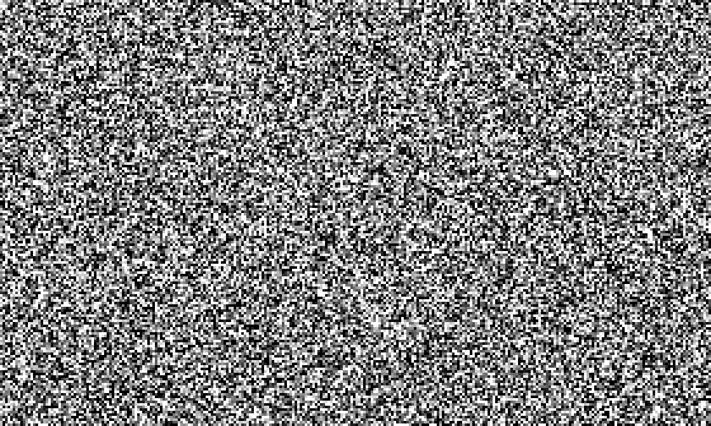
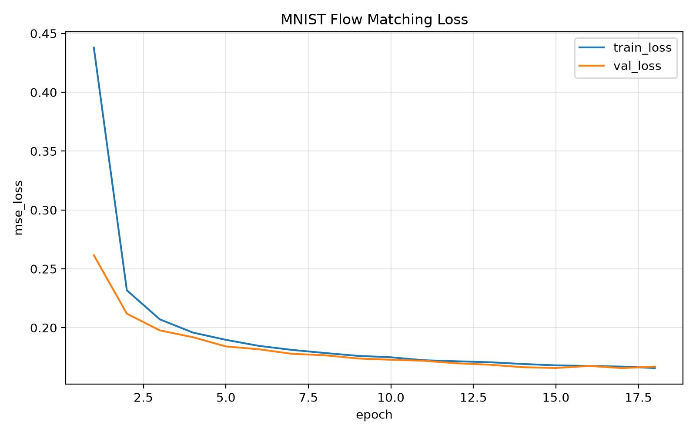

# vis-flow-matching

本目录是一个独立的 MNIST Flow Matching 可视化 demo，用来把理论公式直接落到动态图上。

目标效果：

```text
高斯噪声 x0 -> ODE flow -> MNIST 数字 x1
```

生成 GIF 默认是 `10` 列 `x` `6` 行：

- 每列对应一个数字类别 `0..9`。
- 每行是同一类别的不同随机样本。
- 动画展示从高斯噪声到清晰数字的 Flow Matching 采样轨迹。

## 算法

训练使用最基础的 Rectified Flow / Flow Matching 目标：

```text
x0 ~ N(0, I)
x1 ~ MNIST(label)
t ~ Uniform(0, 1)
xt = (1 - t) * x0 + t * x1
v_target = x1 - x0
v_theta = model(xt, t, label)
loss = MSE(v_theta, v_target)
```

采样时从噪声开始做 Euler ODE 积分：

```text
dx / dt = v_theta(x, t, label)
```

## 训练

默认会通过 `torchvision.datasets.MNIST(download=True)` 下载 MNIST 到 `dataset/torchvision`。

```bash
python vis-flow-matching/train.py \
  --data-dir dataset/torchvision \
  --output-dir vis-flow-matching/runs/mnist_flow \
  --epochs 100 \
  --batch-size 256 \
  --lr 2e-4 \
  --patience 3 \
  --min-delta 1e-4 \
  --seed 42
```

Mac 上会优先使用 `mps`，否则用 `cuda` 或 `cpu`。训练使用 MNIST 官方 `train=True` 训练集，使用官方 `train=False` test set 作为验证集并按 `val_loss` 保存 `best.pt`；默认最多跑 `100` 个 epoch，但 `val_loss` 连续 `3` 个 epoch 没有超过 `1e-4` 的有效改善就 early stop。

输出：

```text
vis-flow-matching/runs/mnist_flow/best.pt
vis-flow-matching/runs/mnist_flow/last.pt
vis-flow-matching/runs/mnist_flow/metrics.csv
vis-flow-matching/runs/mnist_flow/metrics.jpg
```

每个 epoch 结束后都会追加 `metrics.csv`，并覆盖保存一次 `metrics.jpg`。图里的标题和坐标标签全部使用英文，避免 matplotlib 中文字体缺失导致显示异常。

默认只保存 `best.pt` 和 `last.pt`。如果需要保留周期 checkpoint，再显式传：

```bash
--checkpoint-every-epochs 10
```

## 生成 10x6 GIF

```bash
python vis-flow-matching/make_gif.py \
  --checkpoint vis-flow-matching/runs/mnist_flow/best.pt \
  --output vis-flow-matching/runs/mnist_flow/mnist_flow_10x6.gif \
  --rows 6 \
  --cols 10 \
  --steps 60 \
  --fps 12 \
  --seed 42
```

输出：

```text
vis-flow-matching/runs/mnist_flow/mnist_flow_10x6.gif
```

## 可视化





## 文件说明

- `model.py`：极简 class-conditional U-Net，输入 `x_t, t, label`，输出速度场。
- `train.py`：训练 MNIST Flow Matching。
- `make_gif.py`：用训练好的 checkpoint 生成 10 列 6 行 GIF。

展示用的 GIF 和 JPG 会提交到 git；checkpoint、CSV 和 config 仍然不提交。
